# OctGL
CSharp Monogame Octree Graphics Library

This project is for [octree](https://en.wikipedia.org/wiki/Octree) spatial representation.

## Build from triangle mesh model ##
### Demo ###
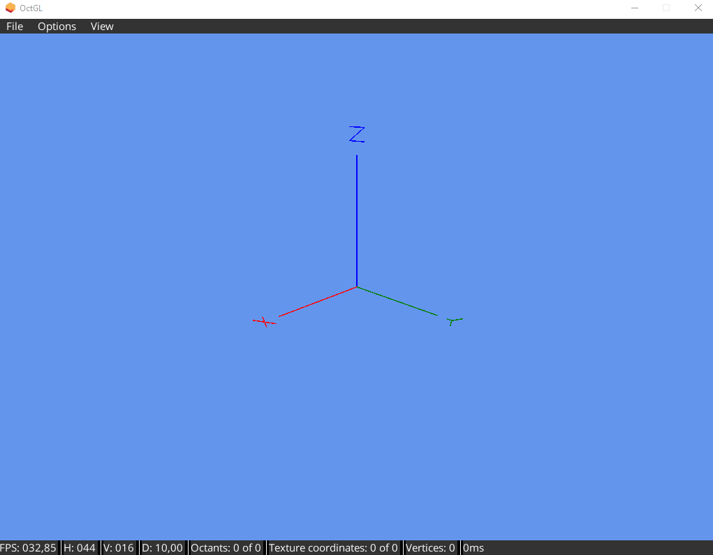

### Fill object and optimize octree ##
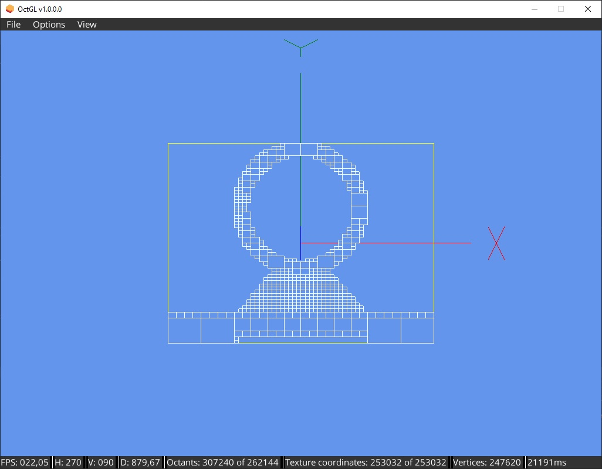

### Show normals ##
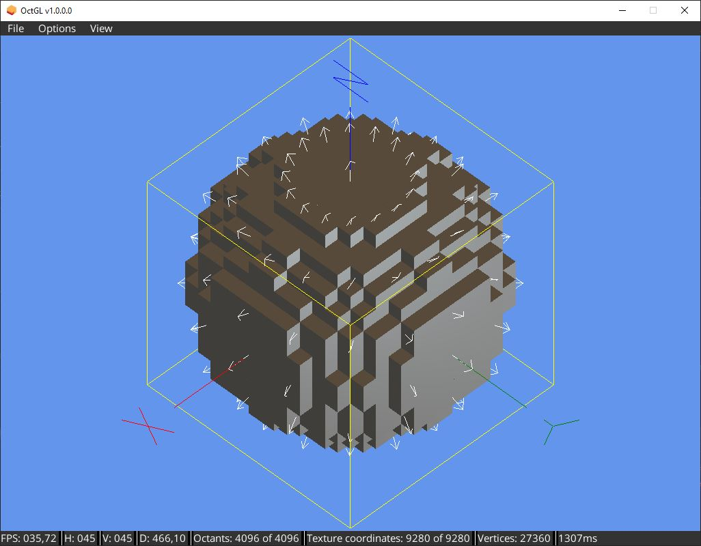

## Operations ##
### Union ###

<table style="padding:10px">
  <tr>
    <td>
      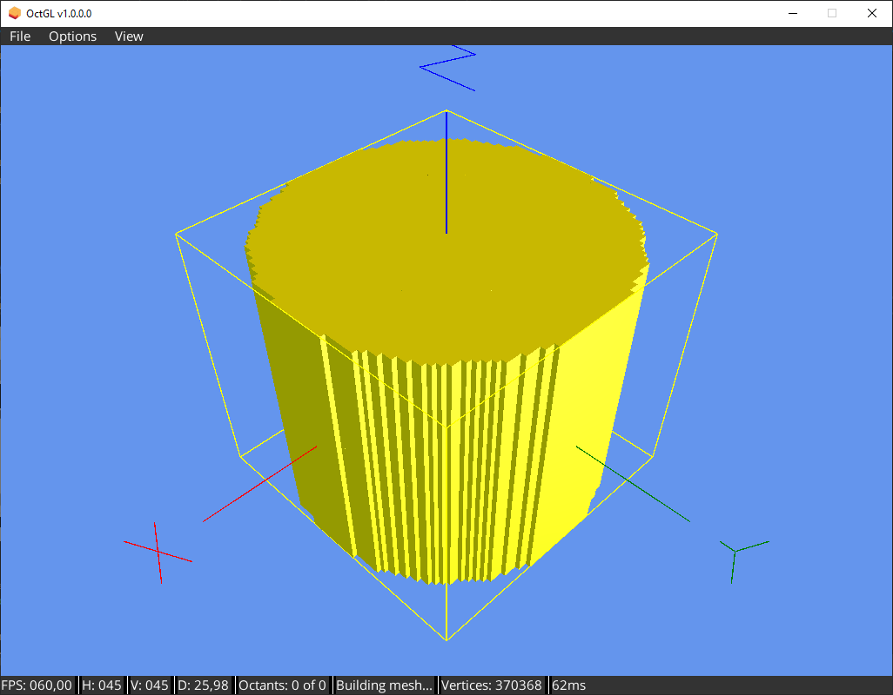
   </td>
   <td>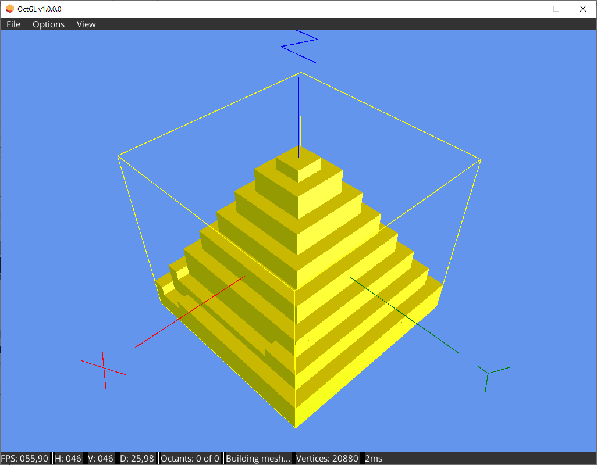</td>
   <td>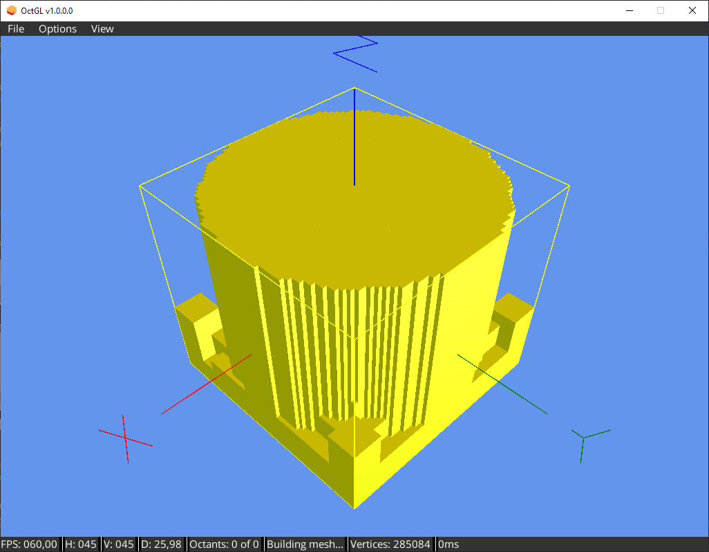</td>
  </tr>
</table>

### Intersection ###

<table style="padding:10px">
  <tr>
    <td>
      
   </td>
   <td></td>
   <td>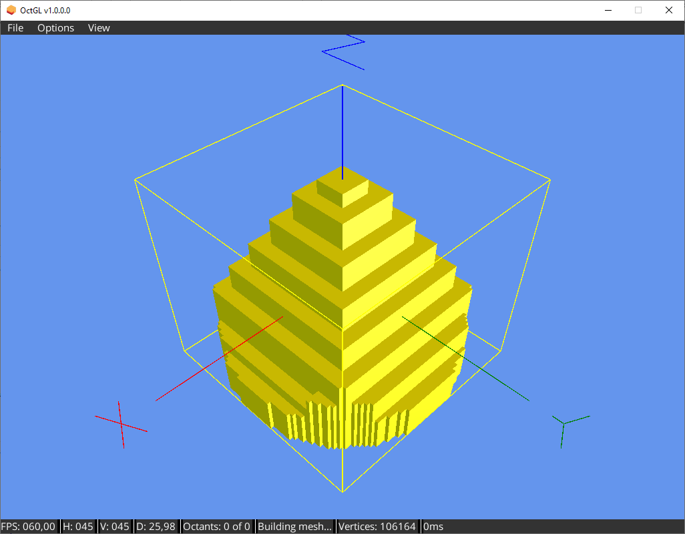</td>
  </tr>
</table>

### Substract ###

<table style="padding:10px">
  <tr>
    <td>
      
   </td>
   <td>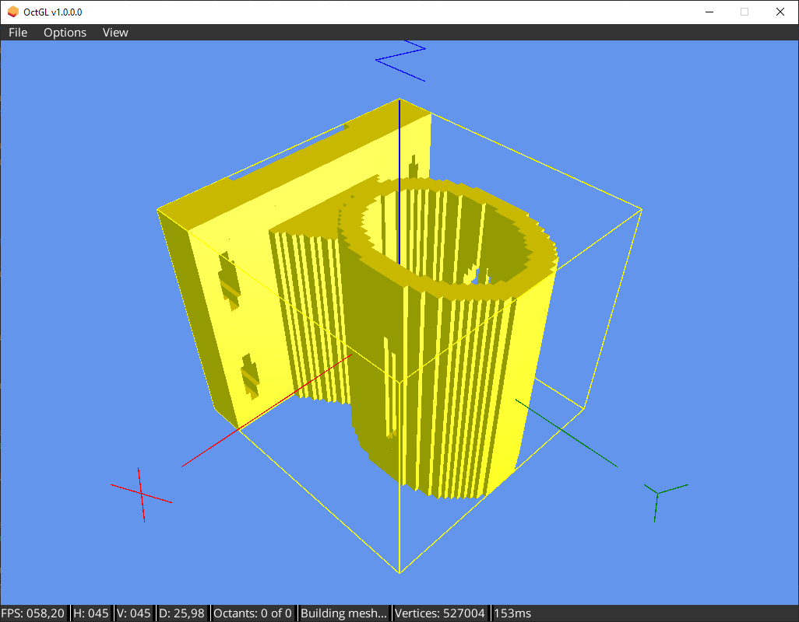</td>
   <td>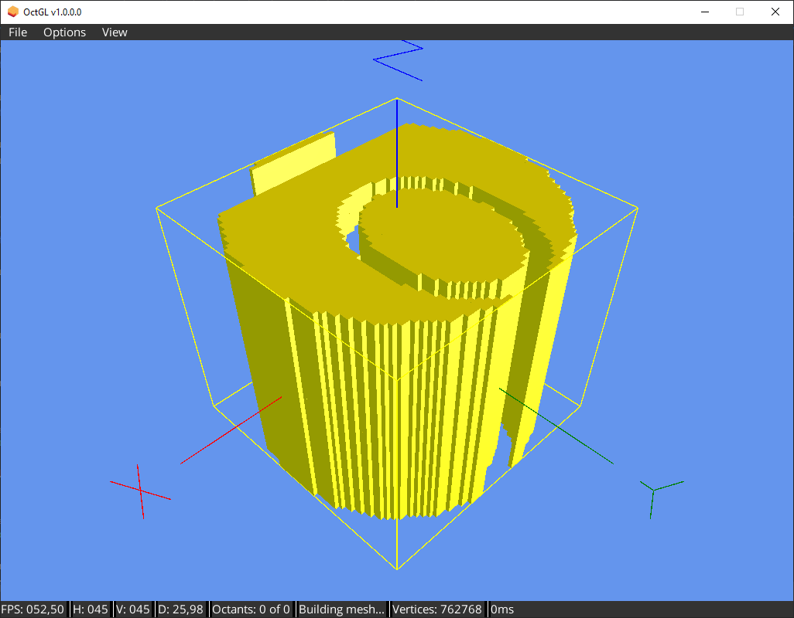</td>
  </tr>
</table>

### Reverse ###

<table style="padding:10px">
  <tr>
    <td>
      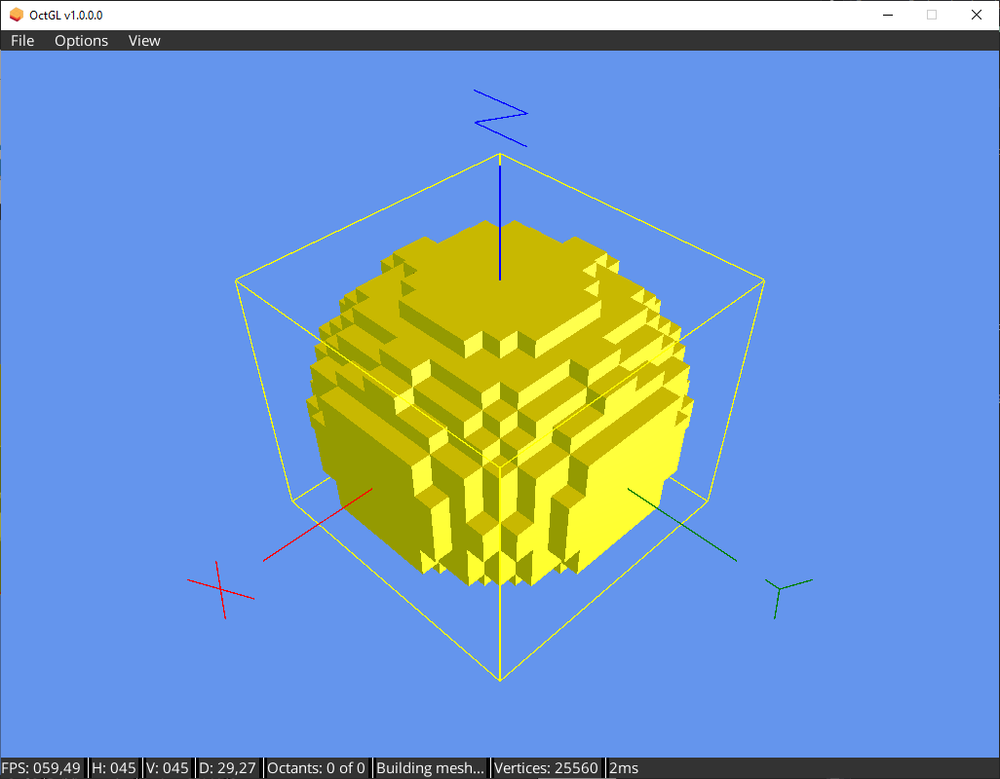
   </td>
   <td>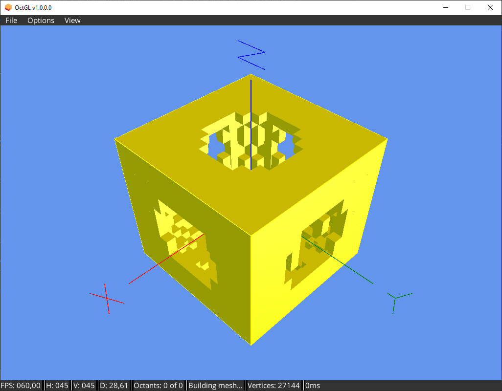</td>
  </tr>
</table>

Compiled with [MonoGame 3.7.1](https://community.monogame.net/t/monogame-3-7-1-release/11173)  
UI created with [Myra](https://github.com/rds1983/Myra)  
Load 3D file models with [AssimpNET](https://github.com/assimp/assimp-net)  
Sample dragon model from [TurboSquid](https://www.turbosquid.com/es/FullPreview/Index.cfm/ID/1129559)  
AABB triangle intersection based on [StackOverflow](https://stackoverflow.com/questions/17458562/efficient-aabb-triangle-intersection-in-c-sharp)  
